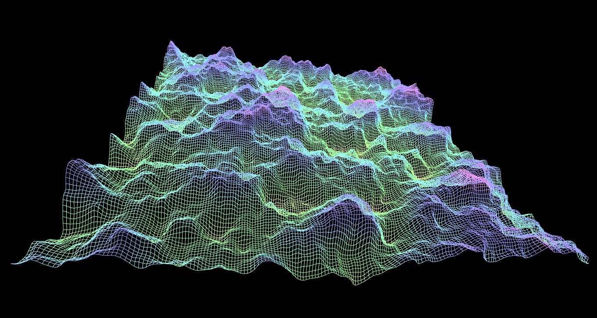
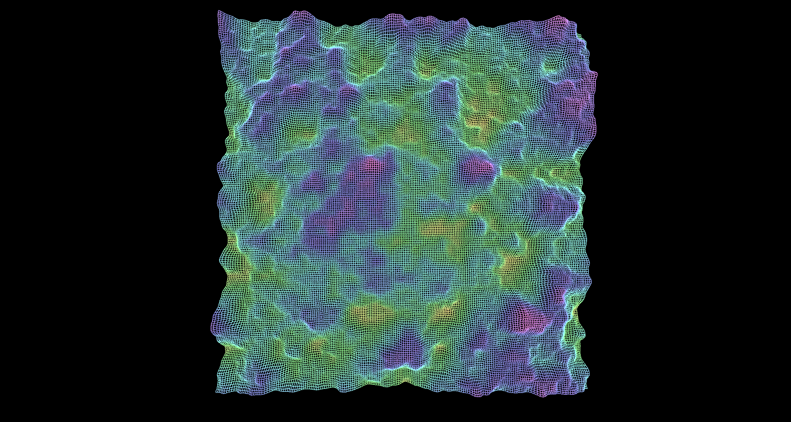

# V0Y4G3
Program napisany w Javie w środowisku graficznym Processing.  
Aby go skompilować wymagane jest środowisko.  
Aplikacja używa bibloteki PeasyCam do płynnego poruszania kamerą.  
  
Program generuje sieć punktów, których wysokość nad poziomem zerowym  
jest zależna od wartości dwuwymiarowego szumu Perlina w danym punkcie.  
Punkty następnie łączone są, tworząc siatkę. Program dodatkowo nakłada  
kolory zależne od wysokości.  
  
Program nie posiada okna dialogowego do konfiguracji generatora,  
więc jedyny dostęp do stałych jest na początku kodu. Można  
tam zmienić:  
-skalowanie szumu - to jak ostre są szczyty  
-wysokość szczytów  
-odległość między węzłami  
-wielkość siatki (powyżej 300x300 program staje się mocno obciążający)  
  
Podczas działania programu, za pomocą SPACJI można poruszać się  
w osi 'Z' szumu Perlina (w górę), dzięki czemu krajobraz płynnie się zmienia.  
  
Przykłady:
  
  

